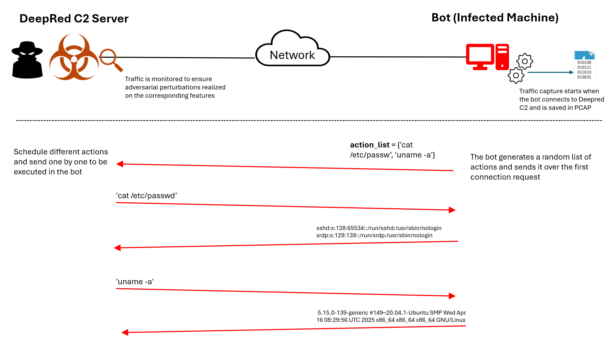
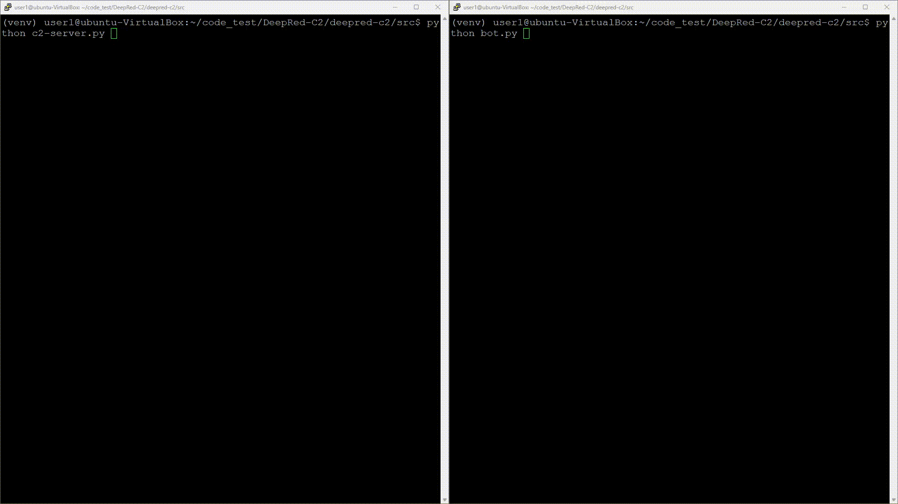

# 🧠 DeepRed Command and Control (C2)

Welcome to the **DeepRed-C2** repository, a WebSocket-based Python application designed to simulate real-time Command and Control (C2) communication. This project was developed as a reproducible artifact for our [USENIX WOOT'25](https://www.usenix.org/conference/woot25) paper and aims to provide an interactive environment for studying adversarial C2 behaviors in networked systems.

📄 Paper title:
DeepRed: A Deep Learning–Powered Command and Control Framework for Multi-Stage Red Teaming Against ML-based Network Intrusion Detection Systems

📚 Dataset title: 
TUC-RedTeam30: A Dataset for Evaluating ML-Based Network Intrusion Detection Systems (https://doi.org/10.5281/zenodo.15662906)

---

## 📦 Overview

This application emulates a botnet communication system comprising:

- `c2-server.py`: the central C2 server (must be run first).
- `bot.py`: represents an infected bot that connects to the server.
- Runtime configuration is interactively defined (IP, port, adversarial settings, PCAP capture, etc.).

Sample DeepRed C2 operation upon the bot connection request



---

## ⚙️ System Requirements
⏱️ Estimated Setup Time: ~5 minutes

💾 Disk Space Requirement: Approximately 2 GB (also including TUC-RedTeam30 Dataset)

🐧 This application has been tested on **Linux (Ubuntu 20.04)**.

### ✅ Install Python 3.11+ and Dependencies

Before running the code, make sure Python 3.11 and related system dependencies are installed:

```bash
sudo apt update
sudo apt install git python3.11-venv python3.11-distutils python3.11-dev python3-pip
sudo apt install tcpdump
```

Then verify pip is compatible:
```bash
python3.11 -m pip --version
# Example output: pip 20.0.2 from /usr/lib/python3/dist-packages/pip (python 3.11)
```
---
## 🚀 Getting Started
1. Clone the Repository
```bash
git clone https://github.com/Mehrdad-hajizadeh/DeepRed-C2.git
cd DeepRed-C2
```
2. Create and Activate Virtual Environment

```bash
python3.11 -m venv venv
source venv/bin/activate
```
3. Install Python Dependencies

```bash
pip install -r requirements.txt

```
---
## ▶️ Running the Code
Both programs will prompt you for runtime settings like C2 IP, port, adversarial configuration, and optional traffic capture.

### Start the DeepRed C2 Server

```bash
cd deepred-c2/src
python c2-server.py
```
### Start the Bot (in a separate terminal or machine)

```bash
cd deepred-c2/src
python bot.py
```
---
##  📝 Example Interactive Session:

This example first demonstrates the execution of the DeepRed C2 server without traffic monitoring enabled. The infected bot connects to the C2 server without triggering any adversarial perturbations. This setup showcases how a compromised system can establish a connection with the C2 server and receive various commands for system discovery and data exfiltration.

#### ```c2-server.py```

```bash
$ python c2-server.py

 Available network interfaces and their IP addresses:
  - lo: 127.0.0.1
  - eth0: 192.168.1.50

 Enter IP address to bind DeepRed C2 server [Press Enter to use 127.0.0.1]: 192.168.1.50
 Enter port for DeepRed C2 server [Press Enter to use 5000]: 5000

 Enable check_termination_condition? [y/N] [Press Enter for No]: 

 DeepRed C2 server initialized at ws://192.168.1.50:5000/
 Waiting for bots to connect...
```

#### ```bot.py```
```bash
$ python bot.py

 Enter the IP address of DeepRed C2 server [127.0.0.1]: 192.168.1.50
 Enter the port number of the DeepRed C2 server [5000]: 5000

 Is adversarial perturbation required? [no]: 

 How many indivdiual flows shoud be generated in (number of iterations)? [1]: 5

 Capture traffic in PCAP? [no]: yes

 Available interfaces: ['lo', 'eth0', 'wlan0']
 Enter the interface to capture on ['eth0']: 
 Default directory:['deepred-c2/pcap']
 Enter the folder path to save PCAP (leave blank for current)['deepred-c2/pcap']:

```


---
## 🗂️ Project Structure


```bash
.
├── dataset       #TUC-RedTeam30: Generated dataset including benign and attack netwrork traffic, collected during 30 different red teaming exercises
├── deepred-c2
│   ├── configs/              # All runtime-generated configs
│   ├── exfiled_data/         # Default folder for received files on the server
│   ├── log/                  # Communication logs for each connected bot
│   ├── pcap/                 # Saved PCAP files (if enabled by the user when running the bot.py)
│   ├── sample_file_to_exfil/ # Sample documents for exfiltration
│   │   ├── doc/
│   │   ├── pdf/
│   │   ├── photo/
│   │   └── video/
│   ├── src/
│   │   ├── c2-server.py
│   │   ├── bot.py
│   │   ├── get_bot_ready.py
│   │   ├── ConfigGenerator.py
│   │   ├── network_config_utils.py  

```
---
##  🧰 Troubleshooting

### 🔐 Permission Issues
#### Scapy and Tcpdump
⚠️ **Attention:**  
For traffic sniffing and PCAP capturing, it is essential to grant the required system-level privileges. Without these, tools used in bot.py (`tcpdump`) or c2-sever.py (`scapy`) may fail to operate properly.

For ```bot.py``` (uses tcpdump before running the code):

```bash
sudo setcap cap_net_raw,cap_net_admin=eip $(which tcpdump)
```
For ```c2-server.py``` (uses scapy):

```bash
sudo setcap cap_net_raw,cap_net_admin=eip $(which scapy)
```
#### Enable Write Access to the Folder
If you get permission errors related to file writing or access:
```bash
sudo chmod -R 777 configs log pcap exfiled_data
```
### 🌐 Network Connectivity 

If you're running the bot on a separate machine, make sure it can reach the DeepRed C2 server over the network — they need to be able to ping each other and communicate without firewall or routing issues.

---
## 📄 Citation

Paper: 
```bash
DeepRed: A Deep Learning–Powered Command and Control Framework for Multi-Stage Red Teaming Against ML-based Network Intrusion Detection Systems
```

Dataset:
```bash
Hajizadeh, M., Golchin, P., Nowroozi, E., Rigaki, M., Valeros, V., Garcia, S., Conti, M., & Bauschert, T. (2025). TUC-RedTeam30: A Dataset for Evaluating ML-Based Network Intrusion Detection Systems [Data set]. USENIX WOOT Conference on Offensive Technologies (USENIX WOOT'25), Seattle, WA, USA. Zenodo. https://doi.org/10.5281/zenodo.15662906
```

---
⚠️ Disclaimer:
This repository is provided strictly for academic and research purposes only. The authors are not responsible for any misuse or unintended consequences.
During bot-to-C2 communication, all changes occur strictly within the project folder. For example, in the case of exfiltration, sample files located in ```deepred-c2/sample_file_to_exfil``` on the bot side are randomly selected and exfiltrated to the C2 server. The exfiltrated data will be stored under ```deepred-c2/exfiled_data``` on the server.